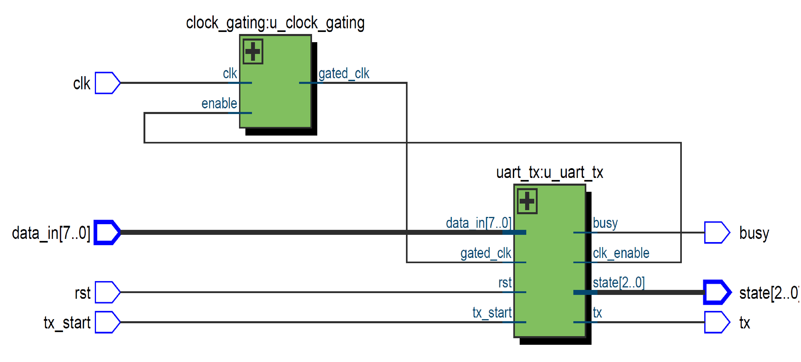
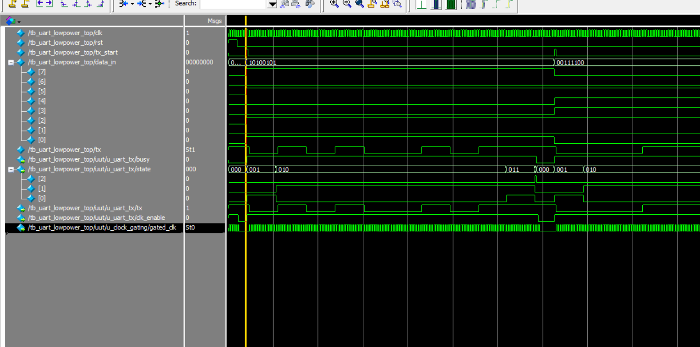

# UART Low Power TX Design with Clock Gating

This project implements a **Low Power UART Transmitter (UART TX)** in **Verilog HDL**,  
featuring **Clock Gating** at the RTL level to minimize power consumption by stopping unnecessary clock toggling during idle periods.

---

## 📚 Project Overview

- Language: **Verilog HDL**
- Goal: Implement clock gating at the RTL level for power reduction
- Tools Used:
  - ModelSim (Simulation)
  - Quartus Prime Lite (Synthesis, RTL Viewer)
- Test Platform: Testbench simulates two UART transmissions to verify `busy`, `state`, and `tx` behavior.

---

## 🏗️ RTL Architecture

> Generated using Quartus RTL Viewer:

- The `clock_gating` module controls the `gated_clk`.
- The `uart_tx` module:
  - FSM logic operates on `clk`
  - Data output toggles with `gated_clk`
- The `clk_enable` signal drives the clock gating control.

---

## 📈 Simulation Waveform

> Simulated with ModelSim to observe UART transmission behavior, busy/status changes, and clock gating effect.

Key observations:
- `tx_start` triggers data transmission
- `busy` signal stays high during transmission and goes low after completion
- `state` transitions correctly: IDLE → START → DATA → STOP → DONE
- `clk_enable` activates during transmission and disables in idle
- `gated_clk` toggles during transmission and freezes during idle for power saving

---

## 🧩 Files Overview

| Filename | Description |
|:---|:---|
| `clock_gating.v` | Simple clock gating module |
| `uart_tx.v` | UART TX module with clock gating support |
| `uart_lowpower_top.v` | Top module integrating clock gating and UART TX |
| `tb_uart_lowpower_top.v` | Testbench for simulation and verification |
| `RTL_uart_lowpower_top.png` | RTL architecture diagram |
| `wave_tb_uart_lowpower_top.png` | Simulation waveform results |

---

## 🚀 How to Simulate

1. Open ModelSim and create a project.
2. Add `tb_uart_lowpower_top.v` and all source files in `src/`.
3. Compile all files.
4. Run simulation.
5. Add the following signals to the waveform:
   - `clk`
   - `tx_start`
   - `rst`
   - `busy`
   - `state`
   - `tx`
   - `clk_enable`
   - `gated_clk`
6. Observe the correct UART transmission and clock gating behavior.

---

## 🔥 Key Design Features

- RTL-level clock gating for industry-standard low-power design
- Separate clock domains: `clk` for FSM, `gated_clk` for TX output
- Accurate state machine transitions
- Real clock toggling stop during idle mode
- Suitable for low-power SoC or MCU UART designs

---

## 🏁 Conclusion

This project demonstrates effective power reduction techniques in UART TX design by implementing clock gating directly at the RTL level.  
The design can be further extended to support features like multi-baudrate control, auto-sleep, and wake-up functionality.

---
